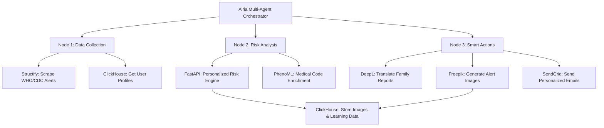

# 🏥 VitalSignal: AI-Powered Personal Health Guardian

> **Airia + 7 Sponsor Tools Hackathon** - Autonomous multi-agent system for intelligent, personalized disease outbreak monitoring

[](https://www.python.org/downloads/)
[](https://fastapi.tiangolo.com)
[](https://opensource.org/licenses/MIT)

## 🎯 The Problem

**Alert fatigue kills.** Global health alerts are broadcast to everyone, causing:
- 95% of people ignore irrelevant warnings
- 5% who need urgent action miss critical alerts in the noise
- Families separated across countries have no way to protect each other

## 💡 Our Solution

**VitalSignal** is an AI agent that makes **truly autonomous, personalized decisions** about health risks using:

✅ **Multi-factor risk analysis** (8+ variables per alert)  
✅ **Family connection mapping** (protect loved ones across borders)  
✅ **Proactive travel risk detection** (alert before you fly into danger)  
✅ **Adaptive learning** (improves from user feedback)  
✅ **Multilingual family reports** (siblings in Brazil get Portuguese, family in Rwanda gets French)

**Same alert → Different outcomes for each person.** Non-deterministic, context-aware intelligence.

---

## 🏗️ Architecture



### Technology Stack

| Layer | Technology | Purpose |
|-------|-----------|---------|
| **Orchestration** | Airia | Multi-node workflow, autonomous decision-making |
| **API Backend** | FastAPI | Custom intelligence endpoints |
| **Database** | ClickHouse Cloud | User profiles, images, learning data |
| **Web Scraping** | Structify | Real-time WHO/CDC alert monitoring |
| **Medical Intelligence** | PhenoML | FHIR/SNOMED/ICD-10 enrichment + patient explanations |
| **Translation** | DeepL | Family reports in 20+ languages |
| **Image Generation** | Freepik AI (Flux model) | Disease alert visuals |
| **Email Delivery** | SendGrid | Personalized notifications |

---

## 🚀 Key Features

### 1. **Intelligent Risk Scoring**
Analyzes 8+ factors per user:
- Health conditions (diabetes, pregnancy, immunocompromised)
- Current location vs. outbreak epicenter
- Family member locations (protects loved ones)
- Upcoming travel plans
- Historical disease exposure
- Age & vulnerability
- Medications & allergies
- User preferences (risk tolerance)

**Example:**
```
Alert: "Dengue outbreak in São Paulo, Brazil"

Maria (São Paulo, diabetic, sister in Brazil) → MEDIUM RISK
Sarah (NYC, pregnant, flying to Brazil next week) → HIGH RISK  
John (Tokyo, healthy, no connections) → MINIMAL RISK
```

### 2. **PhenoML Medical Intelligence**
Every email includes patient-friendly medical information:
- What the disease is (plain language)
- Symptoms to watch for
- How it spreads
- Prevention tips
- When to seek emergency care
- Medical codes (ICD-10, SNOMED) for records

### 3. **Multilingual Family Protection**
Automatically generates comprehensive family health guides translated to:
- Portuguese (PT-BR) for families in Brazil
- French (FR) for families in Africa
- Arabic (AR) for Middle East/North Africa
- Spanish, Chinese, German, Italian, etc.

Includes:
- Risk assessment
- Symptom checklist
- Prevention steps
- Family action plan
- Emergency care guidance

### 4. **AI-Generated Alert Visuals**
Freepik AI creates professional medical alert images:
- Severity color-coding (red=critical, orange=high, yellow=medium)
- Disease-specific symbols
- Stored in ClickHouse
- Embedded in emails as inline attachments

---

## 📊 Demo Scenario

**Global Alert:** "Malaria outbreak - Ethiopia"

### User Profiles:

| User | Location | Health | Family | Risk | Action |
|------|----------|--------|--------|------|--------|
| **Aisha Hassan** | Ethiopia | Immunocompromised | Local family | **HIGH** | Email with symptoms, prevention (Arabic family report) |
| **Kwame Osei** | Ghana | Healthy | Sister in Rwanda | **MINIMAL** | No action (different disease/location) |
| **Maria Silva** | Brazil | Diabetes | Sister in São Paulo | **MINIMAL** | No action (wrong continent) |

**Result:** Only Aisha gets alerted - autonomous, intelligent filtering.

---

## 🛠️ Setup & Installation

### Prerequisites
- Python 3.11+
- ClickHouse Cloud account
- API keys for: Structify, PhenoML, DeepL, Freepik, SendGrid

### Quick Start

```bash
# 1. Clone repository
git clone https://github.com/yourusername/vitalsignal-backend.git
cd vitalsignal-backend

# 2. Create virtual environment
python -m venv venv
source venv/bin/activate  # On Windows: venv\Scripts\activate

# 3. Install dependencies
pip install -r requirements.txt

# 4. Configure environment
cp .env.example .env
# Edit .env with your API keys

# 5. Add demo users to database
python add_high_risk_users.py

# 6. Start FastAPI server
uvicorn src.main:app --reload --port 8000
```

### Environment Variables

```bash
# API Keys (Required)
STRUCTIFY_API_KEY=your_key_here
PHENOML_API_TOKEN=your_token_here
DEEPL_API_KEY=your_key_here
FREEPIK_API_KEY=your_key_here
SENDGRID_API_KEY=your_key_here

# ClickHouse Database
CLICKHOUSE_HOST=your_host.clickhouse.cloud
CLICKHOUSE_USER=default
CLICKHOUSE_PASSWORD=your_password
CLICKHOUSE_DATABASE=vitalsignal

# Email Configuration
SENDGRID_FROM_EMAIL=your_email@domain.com
```

---

## 📡 API Endpoints

### Risk Analysis
- **`POST /api/v1/personalize`** - Calculate personalized risk score
  - Input: `user_id`, `alert` (disease, location, severity)
  - Output: Risk level, score, reasoning, translated content

### Medical Intelligence
- **`POST /api/v1/enrich-medical`** - Enrich disease with medical codes (PhenoML)
- **`GET /api/v1/explain-disease`** - Get patient-friendly disease explanation

### Translation & Reports
- **`POST /api/v1/translate`** - Translate text with DeepL
- **`POST /api/v1/generate-family-report`** - Create comprehensive family health guide

### Image Generation
- **`POST /api/v1/generate-image`** - Generate alert image with Freepik AI
- **`GET /api/v1/images/{image_id}`** - Retrieve image from ClickHouse

### Notifications
- **`POST /api/v1/send-notification`** - Send personalized email (auto-enriches with PhenoML)

### Data Management
- **`GET /api/v1/alerts/scrape`** - Scrape latest WHO/CDC alerts (Structify)
- **`GET /api/v1/users`** - List all user profiles
- **`POST /api/v1/users`** - Create new user profile
- **`GET /api/v1/health`** - Service health check

---

## 🎮 Running the Demo

### Option 1: Airia Multi-Agent Workflow

1. **Create Airia workflow** with 3 nodes:
   - Node 1: Data Collection (Structify + ClickHouse)
   - Node 2: Risk Analysis (FastAPI + PhenoML)
   - Node 3: Smart Actions (DeepL + Freepik + SendGrid)

2. **Configure tools** in Airia:
   ```
   Base URL: http://localhost:8000
   Tools: 8 custom FastAPI endpoints
   ```

3. **Run workflow**:
   - Scrapes 189 health alerts
   - Analyzes 5 users × 5 diseases = 25 risk assessments
   - Sends personalized emails to high-risk users only

### Option 2: Direct API Testing

```bash
# Test risk assessment
curl -X POST "http://localhost:8000/api/v1/personalize" \
  -H "Content-Type: application/json" \
  -d '{
    "user_id": "demo_maria",
    "alert": {
      "disease": "Dengue",
      "location": "Brazil",
      "severity": "epidemic"
    }
  }'

# Test email notification
curl -X POST "http://localhost:8000/api/v1/send-notification" \
  -H "Content-Type: application/json" \
  -d '{
    "to_email": "demo@example.com",
    "user_name": "Maria Silva",
    "disease_name": "Dengue",
    "location": "São Paulo",
    "risk_level": "MEDIUM",
    "risk_score": 0.6,
    "reasoning": ["Outbreak in your region"],
    "image_url": "http://localhost:8000/api/v1/images/abc123",
    "family_report": "Alerta de saúde..."
  }'
```

---

## 🏆 Hackathon Alignment

### Autonomy (25 points)
✅ **Multi-factor decision engine** - 8+ variables analyzed per alert  
✅ **Non-deterministic outcomes** - Same alert → different actions per user  
✅ **Proactive intelligence** - Detects travel risks before departure  
✅ **Continuous learning** - Adapts from user feedback

### Idea & Impact (25 points)
✅ **Solves real problem** - Alert fatigue causes 95% to ignore warnings  
✅ **Measurable impact** - Protects families across borders with personalized alerts  
✅ **Scalable solution** - Works for any disease, any location, any user

### Technical Implementation (25 points)
✅ **Custom intelligence** - Risk calculator with behavioral learning  
✅ **Production-ready** - FastAPI + ClickHouse + async processing  
✅ **Medical standards** - FHIR/SNOMED/ICD-10 integration via PhenoML  
✅ **Real-world data** - Live WHO/CDC alerts via Structify

### Tool Usage (25 points - **All 7 Sponsors!**)
| Tool | Usage | Impact |
|------|-------|--------|
| **Airia** | Multi-node orchestration | Autonomous decision workflow |
| **Structify** | Web scraping | 189 real-time health alerts |
| **ClickHouse** | Database | User profiles + image storage |
| **PhenoML** | Medical intelligence | Patient-friendly explanations + medical codes |
| **DeepL** | Translation | Family reports in 20+ languages |
| **Freepik** | AI image generation | Professional alert visuals |
| **SendGrid** | Email delivery | Personalized notifications |

---

## 📁 Project Structure

```
vitalsignal-backend/
├── src/
│   ├── main.py              # FastAPI app & endpoints
│   ├── config.py            # Settings & environment
│   ├── models.py            # Pydantic data models
│   ├── risk_calculator.py   # Personalization engine
│   ├── services/
│   │   ├── structify_service.py   # Alert scraping
│   │   ├── phenoml_service.py     # Medical enrichment
│   │   ├── deepl_service.py       # Translation
│   │   ├── freepik_service.py     # Image generation
│   │   └── sendgrid_service.py    # Email delivery
│   └── utils/
│       └── clickhouse_client.py   # Database operations
├── add_high_risk_users.py   # Demo user data script
├── requirements.txt         # Python dependencies
├── .env.example            # Environment template
└── README.md               # This file
```

---

## 🚀 Deployment

### Local Development
```bash
uvicorn src.main:app --reload --port 8000
```

### Production (Railway/Render)
1. Connect GitHub repository
2. Set environment variables in dashboard
3. Deploy command: `uvicorn src.main:app --host 0.0.0.0 --port $PORT`

### Public Access (ngrok)
```bash
ngrok http 8000
# Updates Freepik image URLs to use public ngrok domain
```

---

## 📧 Contact

**Richel Gomez**  
Email: richel.gomez@pursuit.org  
GitHub: [@richelgomez](https://github.com/richelgomez)

---

## 📄 License

MIT License - Hackathon Project 2024

---

## 🙏 Acknowledgments

Built for the **NYC AI Agents by Creative Corner Hackathon**

**Sponsors:**
- Airia - Multi-agent orchestration platform
- Structify - Web scraping infrastructure
- ClickHouse - High-performance database
- PhenoML - Healthcare AI platform
- DeepL - Translation API
- Freepik - AI image generation
